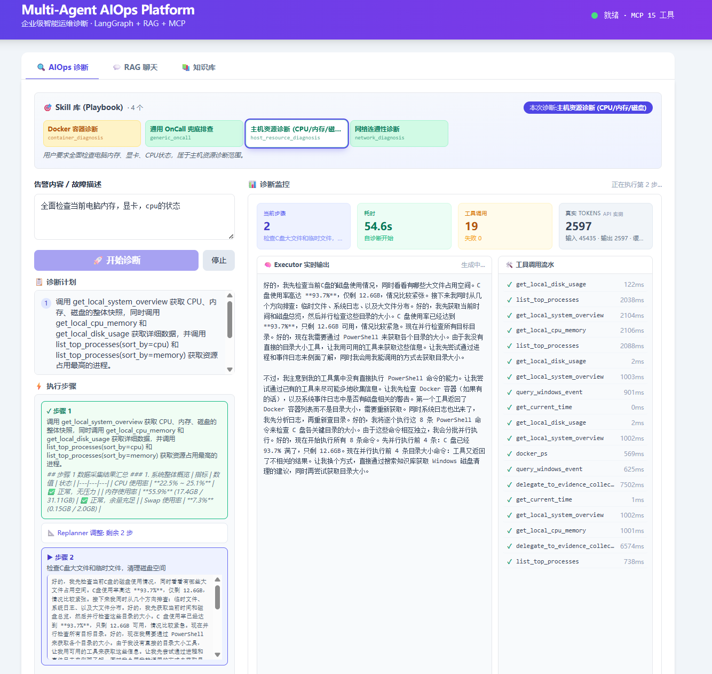
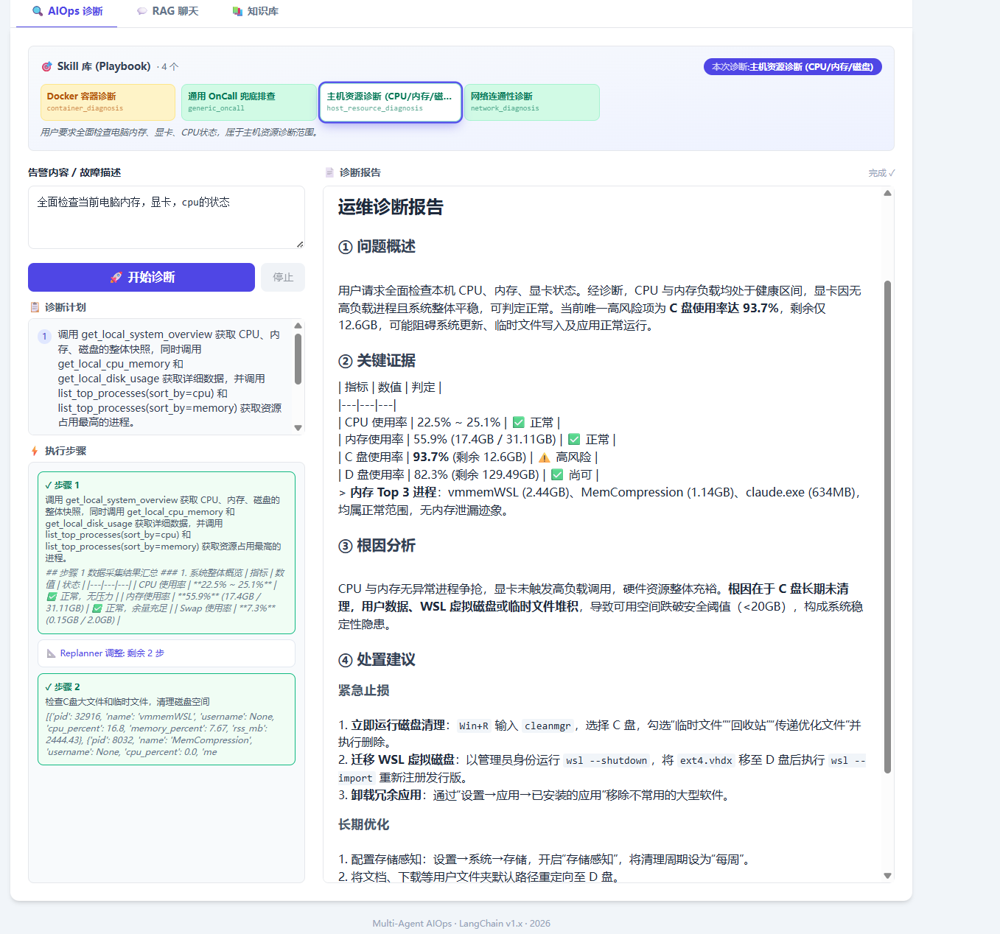
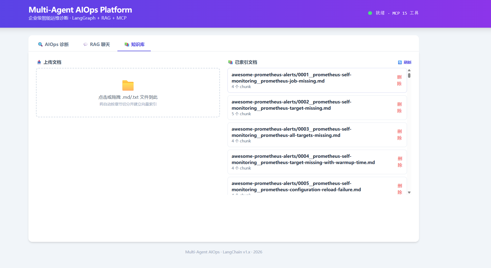

# ReAct based Multi-Agent Diagnosis System

一个由LangGraph驱动的用户级异常诊断平台。用户输入告警后，系统自动选 Skill、定计划、调工具、复盘、出报告——五步走完一个完整的诊断闭环。受渐进式披露（Progressive Disclosure）思想的启发，根据用户输入动态选择诊断用的 Skill，避免一上来就把全部工具和 SOP 塞进上下文。

**v3 起，诊断支持 fast / deep 双模式**：日常告警走 fast 单图（SkillRouter→Planner→Executor⇄Replanner→Report），延迟低；critical / 影响面大的故障走 deep 多 Agent 取证图（IncidentManager→CorrelationContext→EvidencePlan→4 个隔离专家并行→EvidenceReducer→RCAJudge→RemediationPlanner→Report），证据链更完整。模式可前端切换，也可由 Alertmanager webhook 按严重度自动选定。两图共享同一套 SSE 事件词表，前端无需为模式分叉渲染逻辑。

<div align="center">

[](https://python.org)
[](https://langchain-ai.github.io/langgraph/)
[](https://fastapi.tiangolo.com/)
[](https://milvus.io/)
[](https://redis.io/)
[](https://docs.celeryq.dev/)

</div>

---

## 为什么还需要一个 AIOps 平台？

现有的两类方案在真实 OnCall 场景下都有问题：

**纯 RAG 问答**：查知识库 → LLM 总结。能查到文档，但拿不到实时系统状态。告警来了你只能说"建议检查 CPU 使用率"。

**单 Agent ReAct**：把全部工具暴露给 LLM，让它自己决定用哪个。工具一多，上下文就炸，LLM 容易选错工具，甚至在同一个工具上反复打转。

所以核心问题变成了：如果让 Agent 先判断故障类型，再只加载该类型对应的 SOP 和工具——会不会更稳？

```text
传统 ReAct:  User → [LLM + 全部工具] → 反复试错 → 可能出报告

本项目:      User → SkillRouter → Planner → Executor(限定工具) → Replanner → Report
                   ↑ 先收敛上下文          ↑ 限定工具白名单      ↑ 证据评估
```

这就是 Skill-Priority 架构。

---

## 架构一览

```
┌───────────────────────────────────────────────────────────────────┐
│                           FastAPI                                  │
│   /api/v1/chat/stream      /api/v1/aiops/diagnose                 │
│   /api/v1/documents/*      /api/v1/webhook/alertmanager           │
│   /api/v1/skills           /api/v1/health/*                       │
└───────────────┬───────────────────────────────┬───────────────────┘
                │                               │
     ┌──────────▼──────────┐         ┌──────────▼──────────┐
     │    RAG Chat (单Agent) │         │  AIOps (多Agent)    │
     │   rag_service.py      │         │  aiops_service.py   │
     └──────────┬──────────┘         └──────────┬──────────┘
                │                               │
                │                    ┌──────────▼──────────┐
                │                    │   aiops_service      │
                │                    │  resolve mode →      │
                │                    │  派发 fast/deep 图    │
                │                    └──────────┬──────────┘
                │                    ┌──────────┴──────────┐
                │                    ▼                     ▼
                │            ┌─────────────┐       ┌─────────────────┐
                │            │  fast 图     │       │   deep 图        │
                │            │ SkillRouter │       │ IncidentManager │
                │            │   ↓         │       │   ↓             │
                │            │ Planner     │       │ CorrelationCtx  │
                │            │   ↓         │       │   ↓             │
                │            │ Executor⇄RAG│       │ EvidencePlan    │
                │            │   ↓         │       │   ↓ (fan-out)   │
                │            │ Replanner   │       │ 4 专家→Reducer  │
                │            │   ↓         │       │   ↓             │
                │            │ Report      │       │ RCA→Remed→Report│
                │            └─────────────┘       └─────────────────┘
                │                    │                     │
                │                    └──────────┬──────────┘
                │                               │
     ┌──────────▼───────────────────────────────▼──────────┐
     │                     Core Layer                        │
     │  LLM Factory    Embedding(BGE)    Milvus              │
     │  Hybrid Search  Reranker(CrossEnc)  MCP Client       │
     │  Skill Registry  Permissions       Tool Filter       │
     └──────────────────────────────────────────────────────┘
```

两条独立链路：

- **RAG Chat**（左）：知识库问答 + 多轮记忆 + 可选 MCP 工具，走 SSE 流式。适合知识型提问，比如"Redis 内存高怎么排查"。
- **AIOps 诊断**（右）：按 `diagnosis_mode` 派发到 fast 或 deep 图，每步都通过 SSE 实时反馈。fast 适合日常告警，deep 适合 critical / 影响面大的故障。

---

## 界面展示

### AIOps 诊断

从左到右：进入诊断，接收告警，Planner 拆步，Executor 执行，Replanner 评估 — 全程流式传输。

<table>
<tr>
<td></td>
<td></td>
</tr>
<tr>
<td align="center"><em>诊断实时过程</em></td>
<td align="center"><em>最终诊断报告</em></td>
</tr>
</table>

### 知识库管理

支持随时上传 `.md` / `.txt` 文档，自动切分、向量化并存入 Milvus。

<p align="center">
  
</p>

---

## Skill-Priority 流程

整个诊断流程拆成 5 个节点：

```
START
  │
  ▼
┌──────────────────────────────────────────────────────┐
│ 1. SkillRouter                                       │
│   输入：用户告警                                       │
│   输出：selected_skill（如 host_resource_diagnosis）   │
│                                                      │
│   LLM 从 4 个 Skill 里选一个，带置信度和理由。          │
│   LLM 调用失败 → 180+ 关键词规则兜底。                 │
│   非 OnCall 输入 → 直接结束。                         │
└──────────────┬───────────────────────────────────────┘
               ▼
┌──────────────────────────────────────────────────────┐
│ 2. Planner                                           │
│   输入：告警 + 选中 Skill 的 SOP Playbook              │
│   输出：2-3 步诊断计划                                 │
│                                                      │
│   用 flash 模型走结构化输出。Playbook 是参考，          │
│   不是死规矩——LLM 可以按实际情况调整。                  │
└──────────────┬───────────────────────────────────────┘
               ▼
┌──────────────────────────────────────────────────────┐
│ 3. Executor                                          │
│   执行 plan[0]，调用该 Skill 白名单内的工具             │
│                                                      │
│   只读工具按 concurrency_safe 分组并行跑。              │
│   写工具排在串行队尾。                                 │
│   每步结果追加到 past_steps。                         │
└──────────────┬───────────────────────────────────────┘
               ▼
┌──────────────────────────────────────────────────────┐
│ 4. Replanner                                         │
│   看证据够不够 → 四选一：                              │
│   a) 继续执行下一步 (≥2 步未完成时跳过 LLM 直接走)     │
│   b) 调整剩余计划                                    │
│   c) 切到另一个 Skill 重新出计划                      │
│   d) 出最终报告                                       │
└──────────────┬───────────────────────────────────────┘
               ▼
┌──────────────────────────────────────────────────────┐
│ 5. Report                                            │
│   用 pro 模型基于 past_steps 合成结构化 Markdown 报告   │
│   5 段：问题概述 / 关键证据 / 根因分析                  │
│        / 处置建议(紧急止损+长期优化) / 结论             │
└──────────────────────────────────────────────────────┘
```

Replanner 用 flash 做决策，再用 pro 写报告。Replanner 的活就是"看进度、选路由"，不需要深度推理。但最终报告是用户唯一会读的东西，值得专门跑一次 pro。质量跟速度两头都顾到。

LLM 有个倾向：证据不够的时候会怀疑"Skill 是不是选错了"，然后提议切一个试试，切过去发现也不对，又切回来。所以加了五道代码门槛——最少步数、最大次数、黑名单、自循环检查、真实性校验——参考了 LangGraph Supervisor + Handoff 的保守设计。

---

## 检索链路

```
Query ──→ ① Vector top-20 ──→ ② [Hybrid: BM25 + RRF] ──→ ③ [Rerank: CrossEncoder] ──→ top-3 ──→ LLM
                 ↑                        ↑                            ↑
            BGE-small-zh              rank_bm25                bge-reranker-base
           (语义匹配)                (精确关键词)               (精细打分)
```

每一层都可以单独开关，哪层挂了就自动降级到上一层：

| 层级 | 开关 | 挂了怎么办 |
|------|------|-----------|
| Vector 检索 | 始终启用 | 返回空 |
| Hybrid (BM25+RRF) | `rag_hybrid_enabled` | BM25 不可用就退回到纯向量 |
| Rerank (CrossEncoder) | `rag_rerank_enabled` | 模型没装或推理失败就退回 Hybrid |

BM25 这一路不用 jieba 分词。它的任务是抓向量容易漏的东西——错误码、服务名、英文缩写——这些不需要中文分词。

---

## 关键设计决策

| 决策 | 选择 | 为什么 |
|------|------|------|
| Agent 编排 | LangGraph StateGraph | conditional edge 原生支持 P-E-R 循环 |
| LLM 路由 | 按模型名切 Provider | LLM 接口低耦合设计 |
| Embedding | 本地 BGE-small-zh | 最好的适用于中文语料的嵌入模型！ |
| 向量库 | Milvus | 生产级HNSW向量数据库 |
| 重排序 | 本地 BGE-reranker-base | - |
| Replanner 决策 | flash 模型 | 看进度做路由，flash 够了 |
| 报告合成 | pro 模型 | 整个链路唯一需要质量的地方 |
| BM25 索引 | 进程内存 | 小规模不用上搜索引擎 |
| 会话记忆 | Redis | 标准流程 |
| 工具权限 | Skill白名单 + Mode + 黑名单 | 参考Claude Code工具沙盒设计 |

---

## 快速开始

**前置**：Python 3.12+、Docker、DeepSeek API Key

```bash
# 1. 依赖
git clone <repo-url> && cd multi_agent_github
conda create -n multi_rag python=3.12 -y && conda activate multi_rag
pip install -r requirements.txt

# 2. 环境变量
cp .env.example .env
# 改 DEEPSEEK_API_KEY 和 KB_ADMIN_TOKEN

# 3. 基础设施打包 (Milvus + Redis + etcd + MinIO)
docker compose up -d

# 4. 导入知识库
python scripts/ingest_kb_corpus.py --dry-run   # 先看切分效果
python scripts/ingest_kb_corpus.py --reset     # 写入 Milvus

# 5. 一键启动
powershell -NoProfile -ExecutionPolicy Bypass -File .\run.ps1
```

首次运行会自动从 HuggingFace 拉取 `bge-small-zh` (~400MB) 和 `bge-reranker-base` (~1GB)

启动后的服务：

| 服务 | 地址 |
|------|------|
| API (FastAPI) | `http://localhost:9900` |
| system MCP (psutil) | `http://localhost:8005/mcp` |
| network MCP | `http://localhost:8009/mcp` |
| winlog MCP | `http://localhost:8008/mcp` |
| docker MCP | `http://localhost:8011/mcp` |

打开 `http://localhost:9900`，在 AIOps 面板输入：

> 我电脑很卡，帮我看下是不是 CPU 或内存太高

或 curl：

```bash
curl -X POST http://localhost:9900/api/v1/aiops/diagnose \
  -H "Content-Type: application/json" \
  -d '{"session_id":"test-001","query":"Redis 实例内存使用率 98%，连接被断开"}'
```

---

## API 速查

Swagger 在 `http://localhost:9900/docs`。

```
POST   /api/v1/aiops/diagnose           多智能体诊断 (SSE)
POST   /api/v1/chat/stream              RAG 知识问答 (SSE)
GET    /api/v1/chat/sessions/:id/history  查看会话
DELETE /api/v1/chat/sessions/:id          清空会话

POST   /api/v1/documents/upload          上传文档 ↑
GET    /api/v1/documents                 文档列表
DELETE /api/v1/documents/:source         删除文档 ↑

GET    /api/v1/skills                    已注册 Skill

POST   /api/v1/webhook/alertmanager      Alertmanager 回调
GET    /api/v1/webhook/history           告警诊断历史

GET    /api/v1/health                    K8s Liveness
GET    /api/v1/health/ready             K8s Readiness
```

带 `↑` 的需要在 Header 里传 `X-KB-Admin-Token`。

---

## 项目结构

```
multi_agent_github/
│
├── app/                          ← Python 代码
│   ├── main.py                   FastAPI 入口，Lifespan，异常处理
│   ├── config.py                 Pydantic Settings，90+ 配置项
│   │
│   ├── api/                      接口层
│   │   ├── middleware.py          CORS / RequestID / Logging
│   │   └── v1/                   chat / aiops / documents / skills / webhook / health
│   │
│   ├── agents/                   智能体
│   │   ├── graph.py              LangGraph 图 (fast), 5 节点 + conditional edges
│   │   ├── state.py              PlanExecuteState TypedDict + Plan/Act 模型
│   │   ├── state_deep.py         DeepDiagnosisState (deep 图状态)
│   │   ├── prompts.py            三套 Prompt
│   │   ├── planner.py            拆任务 → Plan
│   │   ├── executor.py           单步执行 + 工具并行
│   │   ├── replanner.py          评估 + 四向决策 + Reroute + pro 报告
│   │   ├── fork_runner.py        fork Skill 子图隔离执行
│   │   ├── metric_agent.py       deep 图: 指标取证专家
│   │   ├── log_agent.py          deep 图: 日志/知识检索专家
│   │   ├── infra_agent.py        deep 图: 运行环境/依赖专家
│   │   ├── runbook_agent.py      deep 图: SOP/Runbook 检索专家
│   │   └── subagents/            可委派子 agent
│   │
│   ├── diagnosis_graphs/          Deep Diagnosis 图
│   │   └── deep_diagnosis_graph.py  8 节点编排: 证据计划→专家并行→归并→RCA→处置→报告
│   │
│   ├── incidents/                诊断模式契约
│   │   └── models.py             DiagnosisMode (fast/deep) + EvidenceSource
│   │
│   ├── orchestration/            诊断编排
│   │   └── diagnosis_mode.py     resolve_effective_mode (deep 开关 gate)
│   │
│   ├── skills/                   Skill 系统
│   │   ├── registry.py           启动扫描，进程级单例
│   │   ├── router.py             SkillRouter (LLM + 关键词兜底)
│   │   ├── models.py             Skill 模型
│   │   └── definitions/          4 个 SKILL.md
│   │
│   ├── services/                 业务服务
│   │   ├── aiops_service.py      AIOps 流式诊断 (fast/deep 派发 + SSE 包装)
│   │   ├── rag_service.py        RAG Chat 流式编排
│   │   ├── chat_memory.py        Redis 会话记忆
│   │   ├── document_service.py   知识库管理
│   │   └── rag/                  检索 / Prompt / 联网 / 消息格式化
│   │
│   ├── core/                     基础设施
│   │   ├── llm.py                三 Provider 工厂
│   │   ├── embedding.py          BGE 本地 Embedding
│   │   ├── vector_store.py       Milvus + advanced_search
│   │   ├── hybrid_retriever.py   BM25 + RRF
│   │   ├── reranker.py           BGE CrossEncoder
│   │   └── mcp_client.py         MCP 多 Server 客户端
│   │
│   ├── tools/                    工具系统
│   │   ├── meta.py               ToolMeta 注册表
│   │   ├── mcp_loader.py         聚合加载
│   │   ├── lazy_mcp_tools.py     两阶段按需发现 (可选)
│   │   └── prom_tool.py          Prometheus 指标工具 (未接入时降级为空)
│   │
│   ├── runtime/                  运行时
│   │   ├── permissions.py        四模式 + 三层决策
│   │   ├── tool_filter.py        白名单 + 黑名单
│   │   ├── tool_runner.py        只读工具并行
│   │   ├── agent_harness.py      模型-角色注册表 (deep 图复用 flash/pro 档位)
│   │   └── transitions.py        转换原因枚举 (含 DEEP_* 深度图节点)
│   │
│   └── schemas/                  数据模型
│       ├── common.py             ApiResponse[T]
│       ├── aiops.py              DiagnosisRequest + EventType
│       ├── chat.py               ChatRequest
│       └── document.py           Upload/List/Delete
│
├── mcp_servers/                  5 个 MCP Server
├── frontend/                     Vite + 原生 JS
├── scripts/                      摄入 / 集成测试 / 迁移验证 / 模拟告警
├── data/kb_corpus/               RAG 语料 (954 文档, 4080 chunks)
├── docs/sop/                     内置 OnCall SOP
├── docker-compose.yml            Milvus + etcd + MinIO + Redis + Attu
├── run.ps1                       一键启动/停止
├── requirements.txt
└── .env.example
```

---
## 完整的AI开发文档
  本项目90%的代码层面工作由Claude Code完成，一份详细的供大模型参考的项目文档说明必不可少，`Dev_AGENTS.md`包含了构建这个项目的所有面向AIGC的文档，可以参考以推广到其他项目的构建上

## V3 — fast / deep 双模式诊断

V3 引入 **双诊断图**：把"日常告警要快"和"重大故障要全"拆成两条独立 LangGraph 流水线，按 `diagnosis_mode` 派发，共享同一套 SSE 事件词表，前端零分叉。

### 两条图

```
fast 图 (默认, 延迟低)                  deep 图 (证据链完整, 延迟高)
─────────────────────────               ─────────────────────────────────
SkillRouter                             IncidentManager      载入诊断对象
  ↓                                       ↓
Planner                                 CorrelationContext   同组告警 + Wiki 经验
  ↓                                       ↓
Executor ⇄ Replanner                    EvidencePlan        规则路由派哪几个专家
  ↓                                       ↓ (fan-out 并行)
Report                                  metric / log / infra / runbook  4 个隔离取证专家
                                          ↓ (fan-in 归并)
                                        EvidenceReducer      归并去重 → 候选根因
                                          ↓
                                        RCAJudge             LLM 看证据排序定根因
                                          ↓
                                        RemediationPlanner   处置建议 (写操作需人工确认)
                                          ↓
                                        Report               确定性 Markdown 报告
```

设计要点：

- **fast 复用既有 Skill-Priority 五步图**，一行没改；deep 是新增的 8 节点确定性编排图，与 fast 并列、互不干扰。
- **deep 的 4 个专家是隔离的一次性 subagent**（s06 范式）：各自跑最小 LLM+工具循环，只把结论压成一条 `Evidence` 写回共享黑板，不读彼此中间推理，避免多 LLM 无约束互聊。
- **deep 大量走确定性**：EvidencePlan 按关键词规则路由（不调 LLM）、EvidenceReducer 按证据类型打分归并、RemediationPlanner 按模板出处置、Report 是 Markdown 模板。**全图只有 4 个专家的内部循环 + RCAJudge 一次判断调 LLM**——少错少飘，成本可控。
- **deep 复用 fast 的 flash/pro 模型分层**（经 `agent_harness` 注册表），不引入新模型档位。
- **降级容错**：任一专家失败 → 产一条 error-Evidence，不抛、不拖垮全图；RCAJudge 拿不到候选时走 `candidates[0]` 兜底；CorrelationContext 无关联历史时降级为空上下文。所以即便部分数据源不可用，deep 图照样跑完出报告。

### 怎么用

**前端切换**：AIOps 面板顶部新增 `日常 (fast) / 深度 (deep)` 分段开关。选 deep 跑完会额外渲染一条"Deep 取证时间线"（取证计划 / 各专家证据 / 候选根因 / RCA 判定 / 处置建议）。

**API 请求**：`DiagnosisRequest` 加了 `diagnosis_mode` 字段，支持中英文别名（`日常`/`常规`/`daily`→fast，`深度`/`depth`/`group`→deep）：

```bash
curl -X POST http://localhost:9900/api/v1/aiops/diagnose \
  -H "Content-Type: application/json" \
  -d '{"query":"数据库 CPU 100% 持续 30 分钟","diagnosis_mode":"deep"}'
```

**Alertmanager webhook 自动选模式**：按告警严重度确定性判定——`critical`/`page`/`p0`/`p1` 级，或本次 webhook 携带 ≥10 条告警 → 自动走 deep，其余走 fast。无需人介入。

### 配置

```ini
# .env
DEEP_DIAGNOSIS_ENABLED=false   # deep 图总开关。True 才真路由到 deep 图;
                              # False 时 deep 请求降级回 fast, mode_selected 事件带 group_agent_reserved 标记
```

默认 `false`：deep 图已验证可编译端到端跑通，但其 `CorrelationContext` 的告警历史回溯依赖尚未接入（会降级为空上下文）。建议本地确认 deep 报告质量后再置 `true` 上线。

### SSE 事件

两图共用同一词表，前端一套渲染逻辑对接。deep 比 fast 多这几类结构化事件（其余 `start`/`plan`/`step_*`/`report`/`complete`/`error` 两图一致）：

| 事件 | 阶段 | 含义 |
|------|------|------|
| `mode_selected` | `diagnosis_mode` | 最终跑哪个图 + deep 是否被降级 |
| `evidence_plan` | `evidence_planned` | 派出哪几个取证专家 |
| `evidence` | `<agent>_evidence` | 某专家产出的一条证据 |
| `candidates` | `candidates_reduced` | 归并后的候选根因 |
| `rca` | `rca_judged` | RCA 判定结果 |
| `remediation` | `remediation_planned` | 处置建议 |

## V2

V2 新增 **RAG 离线评测基准集** — `benchmark/` 目录提供系统化的检索与生成质量评估能力，解决 V1 "只有印象、没有数据"的问题。

核心交付：

- **50 题评测数据集**：覆盖 10 个 OnCall 高频场景，每条带人工标注 gold answer 和检索 gold
- **双模式评测脚本**：Retrieval R@K（纯检索，秒级出结果）和 RAGAS + OpenEvals（端到端，调 LLM judge）
- **A/B 对比开关**：一键关闭 hybrid / rerank，观察各层对指标的独立贡献
- **滚动均值输出**：逐题打印指标，跑完立即看到趋势，不用等全量跑完

> `benchmark/` 目录的完整使用说明见 [benchmark/README.md](benchmark/README.md)。

## Benchmarks

`benchmark/` 目录包含两套 RAG 离线评测集（50 题）、一个实时评测脚本和历史报告。

### 评测体系

| 评测模式 | 数据集 | 评测内容 |
|---------|--------|---------|
| Retrieval R@K | `retrieval_rk_50.jsonl` | hit@k / mrr@k / recall@k — 纯检索，不调 LLM |
| RAGAS 端到端 | `ragas_qa_50.jsonl` | Faithfulness / Answer Relevancy / Context Precision / Context Recall |
| OpenEvals (可选) | 同上 | Groundedness / Helpfulness — 并行 RAGAS 运行 |

两个数据集各 50 条，覆盖 10 个 OnCall 高频场景（Redis / MySQL / Kubernetes / CPU & Load / 内存 / 磁盘 / Nginx / JVM / Kafka / Trace & etcd），每个场景 5 条。

### 快速开始

```bash
# 前置：Docker 里的 Milvus 已启动，且已重建知识库
docker compose up -d
python scripts/ingest_kb_corpus.py --reset --batch 8

# Retrieval R@K（推荐先跑，最快）
python benchmark/run_benchmark.py retrieval --k 3

# RAGAS 端到端（会调 LLM，较慢）
python benchmark/run_benchmark.py ragas --limit 5

# 关闭 OpenEvals，只跑 RAGAS 四项
python benchmark/run_benchmark.py ragas --limit 5 --no-openevals
```

### A/B 对比

```bash
# 关闭 rerank 观察影响
python benchmark/run_benchmark.py retrieval --k 3 --no-rerank

# 关闭 hybrid（纯向量检索）
python benchmark/run_benchmark.py retrieval --k 3 --no-hybrid

# 只测某个场景
python benchmark/run_benchmark.py retrieval --scenario Kafka --k 3
```

检索侧指标：

- **hit@k** — top-k 是否命中任意 gold（Gold 支持 `relevant` 单组和 `relevant_groups` 多知识点组）
- **mrr@k** — 第一个命中位置的倒数排名
- **recall@k** — top-k 覆盖的知识点组比例

### 历史数据（优化前后对比）

以下数据来自一次早期的离线评估（24 题 + 954 文档），记录了 Skill-Priority 架构引入前后的效果：

| 指标 | 优化前 | 优化后 |
|------|--------|--------|
| Planner prompt tokens | 9,098 | 575 |
| 全链路 prompt tokens | 10,526 | 2,450 |
| 全链路 total tokens | 11,889 | 3,988 |
| 只读工具并行耗时 | 1.06s | 0.22s |
| RAG Recall@3 | — | 95.83% |
| RAG MRR | 0.882 | 0.938 |

Token 数据来自 DeepSeek 的 `usage` 回传，并行工具数据是 5 个独立只读工具的基准测试。

评测结果写入 `benchmark/reports/`，加 `--verbose` 可输出扣分原因和逐题详情。

---

## License & Credits

本项目以MIT License发布

知识库语料整理自 [samber/awesome-prometheus-alerts](https://github.com/samber/awesome-prometheus-alerts)（CC BY 4.0）。
